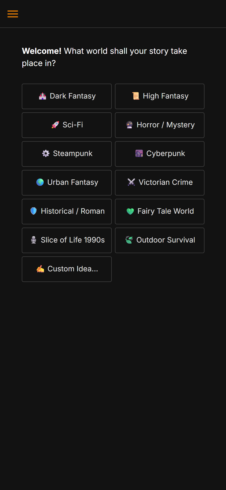
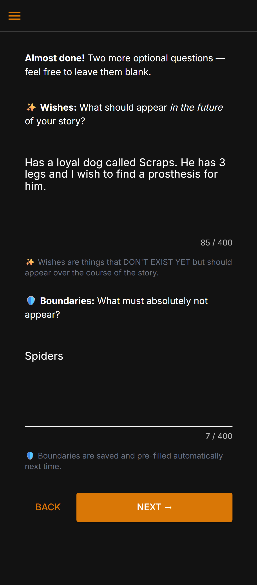
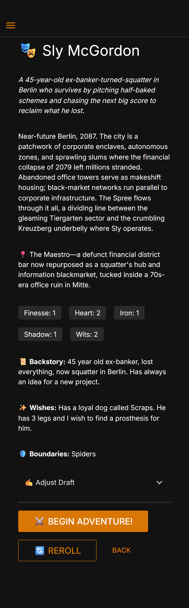
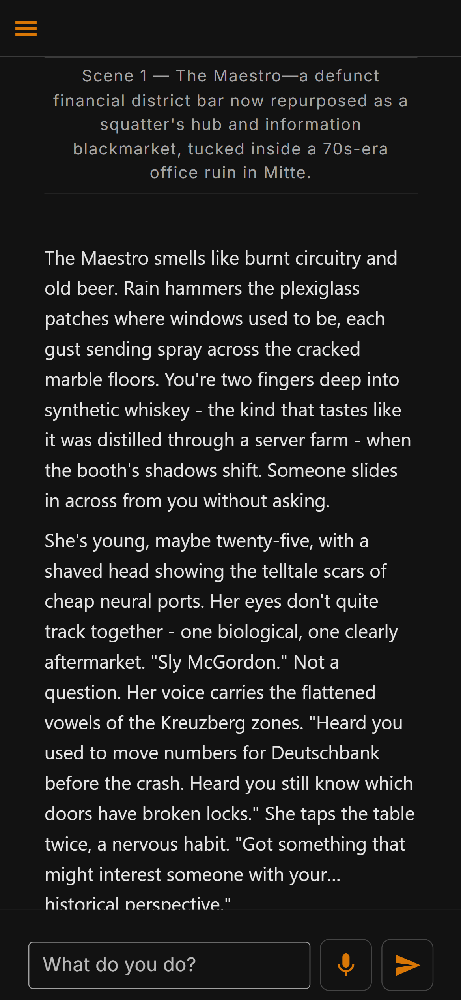
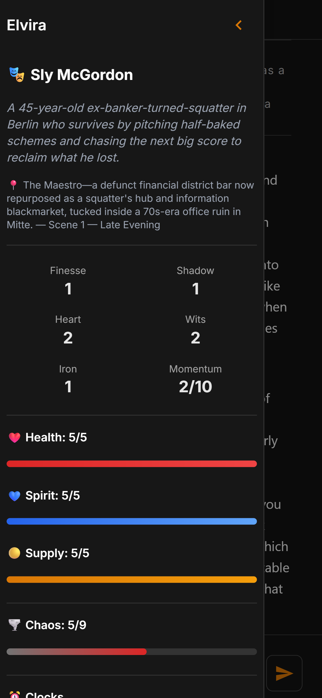

# EdgeTales - A Narrative Solo RPG Engine

> *AI-powered solo roleplaying. You write the action. The AI writes the world.*

[](https://python.org)
[](https://nicegui.io)
[](https://anthropic.com)
[](LICENSE)
[]()
[]()

---

EdgeTales is a self-hosted, AI-driven solo tabletop RPG engine. Type what your character does - the engine parses your intent, rolls the dice, and an AI narrator responds with atmospheric prose. Use voice input and text-to-speech, and run it on your home server, Raspberry Pi, or laptop.

---

## 🧭 Who is this for?

**You love story-driven roleplaying, but can't always find other players.** Scheduling a group campaign is hard. EdgeTales is designed for exactly those moments - a full RPG experience, solo, whenever you want, for as long as you want.

**You have accessibility needs that make traditional tabletop difficult.** Reading long text or typing for extended periods can be exhausting. EdgeTales supports full voice input and output: speak your actions aloud, and have the narrator read every scene back to you. It works well for people with visual impairments, motor difficulties, dyslexia, or anyone who simply finds listening easier than reading.

**You want a real game, not just a chatbot.** Unlike asking an AI to "run a D&D campaign," EdgeTales has an actual rules engine running underneath. Hidden dice mechanics, momentum, chaos, NPC relationship tracking, and narrative arc management all happen in the background - structuring the story without you ever needing to think about them. The AI doesn't freestyle; it operates within a framework that ensures tension, consequences, and satisfying story beats.

---

## ✨ Key Features

**Narrative**
- Free-form player input - type anything, the AI understands your intent
- Triple-AI architecture: fast *Brain* (Haiku) parses mechanics, creative *Narrator* (Sonnet) writes the scene, strategic *Director* (Haiku) steers story pacing and NPC development behind the scenes
- Player Authorship guarantee - your exact words are never rewritten or reinterpreted by the AI
- Dynamic NPC system with persistent memory, evolving dispositions, bonds, agendas, and mid-game discovery
- NPC memory and reflection: characters remember what you did and form opinions over time - the Director periodically synthesises their accumulated experiences into higher-level insights that shape their future behaviour
- AI-generated epilogues that wrap up your story with a satisfying conclusion
- Campaign mode - continue into a new chapter with the same character, NPCs, and world

**Mechanics** - *borrowed from the best tabletop RPGs*

EdgeTales doesn't invent its own rules from scratch. It draws on proven, beloved tabletop systems and adapts them for AI-driven solo play:

- **Action Roll (from Ironsworn / Starforged by Shawn Tomkin):** Roll 2d6 + a character stat, compare against two separate 2d10 challenge dice. Beat both = strong hit. Beat one = weak hit with a cost. Beat neither = miss. This two-dice challenge system creates a nuanced outcome space that the AI narrator uses to calibrate how well things go - not just pass/fail.

- **Stats / Character Attributes (from Ironsworn):** Five stats - Heart, Iron, Wits, Shadow, Edge - map to different approaches: social, forceful, careful, deceptive, fast. You distribute points between them at character creation, shaping what your character is good at.

- **Momentum (from Ironsworn):** Successful actions build momentum. When things would go badly, you can burn accumulated momentum to turn a miss into a hit - at the cost of resetting it. This creates a satisfying risk/reward rhythm over the course of a session.

- **Chaos Factor (from Mythic Game Master Emulator by Tana Pigeon):** A hidden number between 1 and 9 that rises when the story gets out of control and falls when the player succeeds. The AI uses it to decide how likely unexpected events are - higher chaos means more surprises, complications, and twists.

- **Fateful Roll / Match (from Ironsworn / Starforged):** When both 2d10 challenge dice land on the same number - roughly a 10% chance - it's a Match. On a hit, something unexpectedly good happens beyond the clean success. On a miss, the situation escalates dramatically into something worse.

- **Position & Effect (from Blades in the Dark by John Harper):** Before each risky action, the engine assesses what position you're in (controlled, risky, desperate) and what effect you can realistically achieve (limited, standard, great). These two axes shape how the narrator frames your attempt and its consequences.

- **NPC Bonds & Dispositions (inspired by Ironsworn's bonds system):** Named characters are tracked persistently. They have dispositions (neutral, friendly, hostile, loyal) and bond levels that shift based on your interactions. The AI narrator knows who trusts you, who resents you, and who owes you a favour.

- **Threat & Progress Clocks (from Blades in the Dark):** Ticking clocks track dangers that build in the background and goals that take multiple steps to achieve. When a threat clock fills, something bad happens whether the player is ready or not. The narrator manages clocks organically within the fiction.

**Tech & UX**
- Mobile-first PWA - add to iOS/Android home screen
- 20+ narration languages - UI in English and German
- Voice I/O: Text-to-Speech (EdgeTTS online / Chatterbox offline with voice cloning) + Speech-to-Text (Whisper)
- Optional invite code for shared/public deployments - protect your API budget
- HTTPS with auto-generated self-signed certificates
- Kid-friendly mode (ages 8–12, see below)
- Multiple save slots with full story export to PDF

**Dice Display - choose your level of crunch**

Not everyone wants to see dice rolls. EdgeTales lets you pick exactly how much mechanical detail is visible:

| Mode | What you see |
|---|---|
| **Hidden** | Nothing - pure story, no numbers visible at all |
| **Simple** | A single line: Strong Hit / Weak Hit / Miss |
| **Detailed** | Full breakdown: dice values, stat used, position, effect, consequences |

The mechanics always run in the background regardless of display mode. The AI narrator always knows the result and responds accordingly - you just choose whether to see the machinery.

**Epilogues & Campaigns**

Stories in EdgeTales have a narrative arc. The engine tracks pacing, tension, and story structure behind the scenes using a blend of Kishōtenketsu and three-act models. When the story reaches its natural conclusion, you're offered a choice:

- **Generate an Epilogue** - the AI writes a closing sequence that reflects on your character's journey, the relationships you built, and how the central conflict resolved. Pure narrative prose, no more dice rolls. Then you can start a **new chapter** (campaign mode) or begin something entirely new.
- **Keep playing** - ignore the suggestion and continue the adventure. The offer won't bother you again.

**Campaign mode** carries your character, stats, NPCs, and world into a new chapter. The AI summarises the previous chapter, your NPC relationships and their memories carry over, and unresolved story threads feed into the new arc. Mechanics reset (health, spirit, supply are restored), but your character's identity and history remain intact. It's the same person, a new adventure.

**Safety Tools - Wishes & Boundaries**

During character creation, you can tell EdgeTales what you want in your story and what you absolutely don't want. These are saved to your profile and pre-filled automatically next time.

- **Wishes** - elements you'd like to see: a loyal animal companion, political intrigue, a slow-burn romance, ancient ruins, moral grey zones.
- **Boundaries** - things that must not appear: specific phobias, violence against children, particular themes or content you'd rather avoid.

These inputs are woven directly into the AI prompts, so the narrator actively avoids your boundaries and leans into your wishes throughout the entire adventure.

**Kid-Friendly Mode (Ages 8–12)**

A dedicated content mode that transforms EdgeTales into a family-safe adventure - without removing tension or making the story boring. The difference is in *how* things happen, not *whether* things happen.

- **Violence is abstract.** Enemies are "defeated" or "flee" - no blood, no killing blows. Combat feels like an animated film.
- **Death is avoided.** Characters are captured, petrified, banished, or put into enchanted sleep. If someone must be gone, it happens offscreen.
- **Tone is always hopeful.** Even dark moments have a way forward. Villains are driven by misunderstanding or fear, not pure evil. Redemption is always possible.
- **Content is age-appropriate.** Puzzles, friendships, outsmarting villains, exploring mysterious places. No romance beyond friendship, no substance use, no horror, no profanity.

The narrative tone reference: *Studio Ghibli, Avatar: The Last Airbender, Harry Potter (early books), Legend of Zelda.* Vivid, imaginative, full of wonder - and still a real story with real stakes.

---

# Screenshots (mobile)

**Character creation** — choose genre, tone, archetype, set wishes & boundaries:






**Describe your character, then review the AI-generated draft:**


# Screenshots (desktop)


**The first scene:**



**Sidebar** — character stats, clocks, chaos meter, story arc, NPCs, save slots:



---

## 🏗️ Architecture

EdgeTales uses a clean 5-file modular architecture:

```
edgetales/
├── app.py              # NiceGUI UI layer - the only framework-specific file
├── engine.py           # Game logic, AI calls, mechanics, save/load (framework-independent)
├── voice.py            # TTS/STT backends: EdgeTTS, Chatterbox, Whisper (framework-independent)
├── i18n.py             # All UI strings, labels, translations (DE + EN)
├── custom_head.html    # CSS, meta tags, PWA manifest injected at startup
│
├── config.json         # Server config: API key, invite code, HTTPS, port (chmod 600)
├── users/              # Per-user data (auto-created)
│   └── <username>/
│       ├── settings.json   # Personal preferences (TTS, language, dice display)
│       └── saves/          # Save files
└── logs/               # Application logs (auto-created)
```

### Triple-AI Pipeline

Every player turn flows through three specialised AI agents, each with a distinct role:

```
Player types action
        │
        ▼
  ┌──────────────┐
  │    Brain     │  Claude Haiku — fast, cheap
  │              │  Parses: move type, stat, intent,
  └──────┬───────┘  target NPC, position, effect
         │  structured JSON
         ▼
  Dice rolled (2d6+stat vs 2d10)
         │  result + full context
         ▼
  ┌──────────────┐
  │   Narrator   │  Claude Sonnet — creative, immersive
  │              │  Writes: atmospheric prose, NPC dialog,
  └──────┬───────┘  world updates, new NPC discovery
         │  narration displayed immediately
         ▼
  ┌──────────────┐
  │   Director   │  Claude Haiku — runs in background
  │              │  Strategic: pacing guidance, NPC reflections,
  └──────────────┘  story arc notes, scene summaries
```

**The Brain** receives the player's raw input along with the full game state and decides *what happens mechanically*: which move to roll, which stat to use, what position and effect apply, and whether the player is moving to a new location. It returns structured JSON - no prose, no creativity.

**The Narrator** receives the Brain's analysis plus the dice result, and writes the scene. It produces atmospheric prose in the player's chosen narration language, plus hidden metadata: NPC updates, memory events, scene context changes, and new character introductions. The narrator never decides outcomes — it dramatises what the dice already determined.

**The Director** runs asynchronously after the narration is already displayed to the player — it never slows down gameplay. Think of it as the showrunner watching from behind the scenes. It analyses what just happened and provides strategic guidance: where should the story go next? Which NPCs have untapped potential? Is the pacing right? When enough has happened to a particular NPC (tracked via an importance accumulator), the Director writes a *reflection* — a higher-level insight about how that character views the player. These reflections feed back into future narrator prompts, giving NPCs the sense of evolving opinions and growing relationships.

The Director also generates enriched scene summaries that replace the Brain's bare-bones log entries, giving the narrator better context about *why* things matter, not just *what* happened.

### Core Design Principle: AI Narrates, It Does Not Decide

The engine guarantees a strict separation: **dice determine outcomes, the AI only provides prose.** Your exact input - dialogue, actions, descriptions - is never rewritten or reinterpreted. The Narrator responds *to* what you write, never *replacing* it. And it never overrides the dice — a miss is always a miss, no matter how eloquent the player's action was.

### NPC Memory System

NPCs in EdgeTales don't just exist in the moment — they remember. Every significant interaction is recorded as a memory event with emotional weight and importance scoring. Over time, the Director synthesises accumulated memories into reflections that capture how the NPC's perspective is shifting. A merchant who watched you defend their shop three times will remember that — and their behaviour will change accordingly, not because of a simple friendship counter, but because the AI has a rich history of specific events to draw from.

NPC descriptions in the sidebar update dynamically when a character undergoes meaningful development, so the cast list reflects who they've become, not just who they were when you first met them.

---

## 🚀 Quick Start

### Prerequisites

- **Python 3.11** - required if you want to use Chatterbox (offline AI TTS). Python 3.12+ is fine if you skip Chatterbox and use EdgeTTS instead.
- **A Claude API key** from [Anthropic](https://console.anthropic.com/) - EdgeTales uses the Claude API exclusively. The prompts are optimised specifically for Claude (Haiku and Sonnet). Other AI providers are not supported. API usage is charged per token by Anthropic; a typical play session costs a few cents.

### Linux / macOS / Windows

```bash
# 1. Clone the repository
git clone https://github.com/YOUR_USERNAME/edgetales.git
cd edgetales

# 2. Create a virtual environment (recommended)
python3 -m venv venv
source venv/bin/activate   # Windows: venv\Scripts\activate

# 3. Install core dependencies
pip install nicegui anthropic edge-tts

# 4. Set up your config
# Copy config.example.json to config.json, add your API key

# 5. Run
python app.py
```

Open your browser at **http://localhost:8080**

> 💡 **That's it.** All configuration lives in `config.json` - no batch files or environment variables needed for basic use.

---

## 📦 Installation

### Core (required)

```bash
pip install nicegui anthropic edge-tts
```

### Optional packages

Install only what you need:

```bash
pip install chatterbox-tts torchaudio   # Offline AI TTS with voice cloning
pip install faster-whisper               # Speech-to-Text (microphone input)
pip install cryptography                 # HTTPS auto-certificate generation
```

| Package | Purpose | Notes |
|---|---|---|
| `nicegui` ≥ 1.4 | Web UI framework | **Required** |
| `anthropic` ≥ 0.30 | Claude AI API client | **Required** |
| `edge-tts` ≥ 6.1 | Online TTS (Microsoft Edge voices) | **Required** |
| `chatterbox-tts` | Offline TTS with voice cloning | **Python 3.11 only.** ~2 GB model download on first run |
| `torchaudio` | Audio processing for Chatterbox | Match your PyTorch version |
| `faster-whisper` | Speech-to-text (STT) | Models: tiny → large-v3 |
| `cryptography` | Auto TLS certificate generation | Only needed for HTTPS mode |

---

## ⚙️ Configuration

EdgeTales is configured via a single `config.json` file in the project root.

### config.json

```json
{
  "api_key": "sk-ant-api03-YOUR-KEY-HERE",
  "invite_code": "",
  "enable_https": false,
  "storage_secret": "",
  "ssl_certfile": "",
  "ssl_keyfile": "",
  "port": 8080,
  "default_ui_lang": ""
}
```

| Key | Required | Default | Description |
|---|---|---|---|
| `api_key` | **Yes** | `""` | Your Anthropic API key |
| `invite_code` | No | `""` | If set, users must enter this code before accessing the app (see below) |
| `enable_https` | No | `false` | Set to `true` to auto-generate a self-signed TLS certificate |
| `ssl_certfile` | No | `""` | Path to a custom SSL certificate (PEM). Overrides auto-generation |
| `ssl_keyfile` | No | `""` | Path to the matching private key |
| `storage_secret` | No | `""` | Secret for signing session cookies. Auto-generated if not set |
| `port` | No | `8080` | Server port |
| `default_ui_lang` | No | `""` | Default UI language for new users. `"de"` = German, `"en"` = English. Empty = German |

> 🔒 On Unix systems, `config.json` is automatically set to `chmod 600` (owner-only) to protect your API key.

### Environment Variable Overrides

Every config.json setting can be overridden by environment variables. This is useful for Docker, systemd, CI/CD, or situations where you don't want secrets in a file:

| Variable | Overrides |
|---|---|
| `ANTHROPIC_API_KEY` | `api_key` |
| `INVITE_CODE` | `invite_code` |
| `ENABLE_HTTPS` | `enable_https` |
| `SSL_CERTFILE` | `ssl_certfile` |
| `SSL_KEYFILE` | `ssl_keyfile` |
| `STORAGE_SECRET` | `storage_secret` |
| `PORT` | `port` |
| `DEFAULT_UI_LANG` | `default_ui_lang` |

The priority order is: **Environment variable → config.json → built-in default.** You can mix and match freely - for example, keep your API key in an ENV var while everything else lives in config.json.

### Invite Code - Protect Your API Budget

If you deploy EdgeTales on your home network or share the URL with friends, you may want to prevent unknown visitors from using your Anthropic API key. Setting an `invite_code` adds a login screen where users must enter the correct code before they can access the app.

When `invite_code` is empty (the default), the login screen is skipped entirely - users go straight to player selection. This is the recommended setup for purely local, single-user use.

The invite system includes rate limiting: after 5 failed attempts from the same IP, that address is locked out for 5 minutes.

### Example Configurations

**Minimal - local use, no access control:**
```json
{
  "api_key": "sk-ant-api03-YOUR-KEY-HERE"
}
```

**English UI by default:**
```json
{
  "api_key": "sk-ant-api03-YOUR-KEY-HERE",
  "default_ui_lang": "en"
}
```

**Home server - HTTPS + invite code:**
```json
{
  "api_key": "sk-ant-api03-YOUR-KEY-HERE",
  "invite_code": "mySecretCode",
  "enable_https": true
}
```

**Custom port + own certificate (e.g. Let's Encrypt):**
```json
{
  "api_key": "sk-ant-api03-YOUR-KEY-HERE",
  "enable_https": true,
  "ssl_certfile": "/etc/letsencrypt/live/example.com/fullchain.pem",
  "ssl_keyfile": "/etc/letsencrypt/live/example.com/privkey.pem",
  "port": 443
}
```

---

## 🏃 API Cost

EdgeTales is designed to be cost-efficient. A typical play session uses:

- **Brain (Haiku):** ~$0.001 per turn — fast classification, minimal tokens
- **Narrator (Sonnet):** ~$0.01–0.02 per turn — the main cost, produces 2-4 paragraphs of prose
- **Director (Haiku):** ~$0.003 per session — runs only when needed (every few turns), not every turn

A one-hour session with ~20 turns typically costs **$0.15–0.30**, depending on scene complexity and narration length.

---

## 🏗️ Deployment on Raspberry Pi

EdgeTales runs well on a Raspberry Pi 4 (2GB+). Create your `config.json` with your settings, then set up a systemd service:

```ini
# /etc/systemd/system/edgetales.service
[Unit]
Description=EdgeTales RPG Engine
After=network.target

[Service]
User=pi
WorkingDirectory=/home/pi/edgetales
ExecStart=/home/pi/edgetales/venv/bin/python app.py
Restart=on-failure

[Install]
WantedBy=multi-user.target
```

```bash
sudo systemctl enable edgetales
sudo systemctl start edgetales
```

All configuration is read from `config.json` in the working directory - no environment variables needed in the service file. If you prefer to keep the API key out of config.json, you can add a single override:

```ini
Environment=ANTHROPIC_API_KEY=sk-ant-YOUR-KEY-HERE
```

---

## 🎮 Gameplay Overview

1. **Create a profile** - pick a username
2. **Create a character** - name, stats (distributed across Heart, Iron, Wits, Shadow, Edge), choose genre/tone/archetype
3. **Play** - type what you do. Examples:
   - `I draw my sword and challenge the guard to single combat`
   - `"We mean no harm," I say, stepping forward with hands raised`
   - `I search the abandoned library for clues about the missing scholar`
4. **Grow** - build momentum, forge bonds with NPCs, survive escalating chaos
5. **Conclude** - when the story reaches its climax, generate an epilogue or keep going
6. **Continue** - start a new chapter with the same character and world, or begin fresh

---

## 🛡️ Security Notes

- **API keys** are stored in `config.json` with `chmod 600` permissions on Unix systems
- The **invite code** system includes rate limiting: 5 failed attempts trigger a 5-minute IP lockout
- **Session cookies** are signed with `storage_secret` - always set this on public deployments (auto-generated if omitted)

---


## 🤝 Contributing

Contributions are welcome! Please open an issue first to discuss what you'd like to change.

1. Fork the repository
2. Create a feature branch (`git checkout -b feature/your-feature`)
3. Commit your changes (`git commit -m 'Add: your feature'`)
4. Push to the branch (`git push origin feature/your-feature`)
5. Open a Pull Request

---

## 📄 License

This project is licensed under the **GNU Affero General Public License v3.0** (AGPL-3.0).

This means: you can use, modify, and self-host EdgeTales freely. If you distribute it or run it as a network service, you must make your source code available under the same license.

For commercial licensing inquiries, please open an issue.

---

## 🙏 Acknowledgements

- [NiceGUI](https://nicegui.io) - Python web UI framework
- [Anthropic](https://anthropic.com) - Claude AI models
- [edge-tts](https://github.com/rany2/edge-tts) - Microsoft Edge TTS
- [Chatterbox](https://github.com/resemble-ai/chatterbox) - Offline AI TTS with voice cloning
- [faster-whisper](https://github.com/SYSTRAN/faster-whisper) - Speech recognition

**Game Design**

EdgeTales was conceptually inspired by V2.1 of the design document [Narrative RPG Engine — Accessible Solo Tabletop With AI as Narrator and Systems Under the Hood](https://blindgamer85.itch.io/narrative-rpg-engine-accessible-solo-tabletop-with-ai-as-narrator-and-systems-u) by **blindgamer85**.

EdgeTales builds on the creative work of these tabletop RPG designers:

- **Shawn Tomkin** - [Ironsworn](https://www.ironswornrpg.com/) and [Starforged](https://www.ironswornrpg.com/product-ironsworn-starforged): Action roll system (2d6+stat vs 2d10), stats, momentum, fateful roll / match mechanic, NPC bonds. Ironsworn is free to use under a Creative Commons Attribution 4.0 license.
- **Tana Pigeon** - [Mythic Game Master Emulator](https://www.wordmillgames.com/mythic-game-master-emulator.html): Chaos factor, the concept of emergent solo play driven by a dynamic tension tracker.
- **John Harper** - [Blades in the Dark](https://bladesinthedark.com/): Position & Effect framework for assessing risk and narrative consequence before an action roll. Threat and progress clocks.
